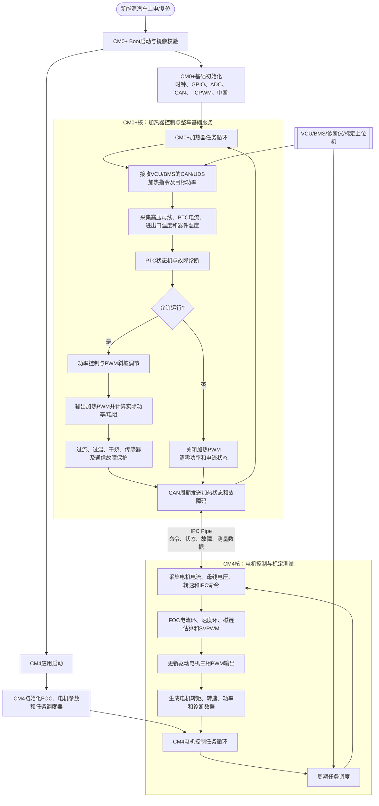
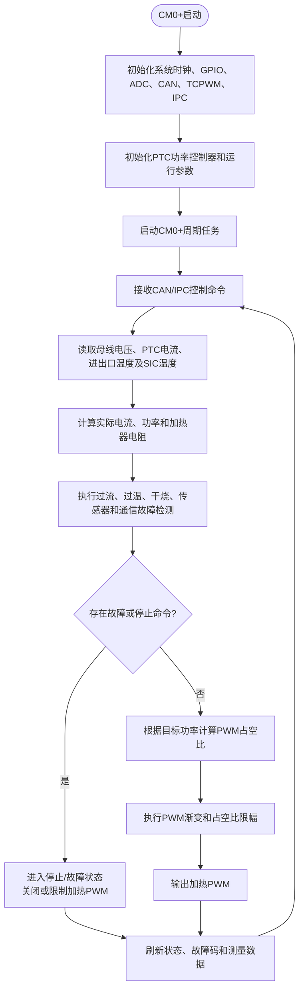
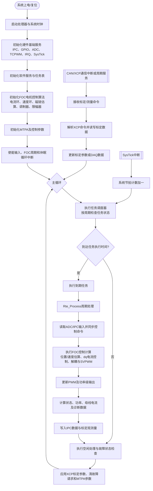
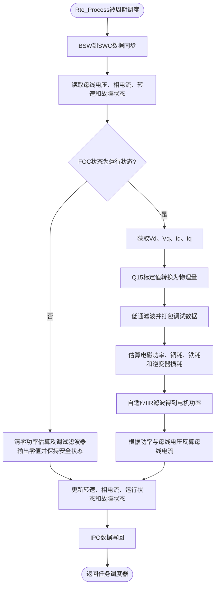

# 新能源汽车双核异构电驱与高压加热控制软件运行流程图（软著材料）

## 软件用途概述

本软件面向新能源汽车电驱动与热管理系统，部署于双核异构 MCU 平台。CM4 核实现新能源汽车驱动电机的矢量控制和运行监测，CM0+ 核实现高压 PTC 加热器的功率调节、温度管理和安全保护；系统通过 CAN/CAN FD、UDS 和 IPC 与整车控制器、BMS 及其他功能模块进行数据交互。

## 1. 双核异构总体运行流程

该系统采用双核异构架构：CM0+核负责加热器、PTC 功率调节、温度采集、故障保护及 CAN/UDS 基础服务；CM4 核负责电机 FOC 控制、PWM 调制、运行状态计算以及 XCP 标定和测量。两个核通过 IPC Pipe 交换控制命令、运行状态、故障信息和测量数据，彼此独立运行并协同完成系统功能。

## 2. CM0+加热器运行流程

CM0+ 加热器控制主要包括目标功率接收、PTC 电流和温度采集、实际功率及电阻计算、功率闭环调节、PWM 渐变输出以及过流、过温、干烧、传感器异常和通信异常保护。故障或停止条件出现时，软件优先关闭或限制加热输出，并通过 CAN 和 IPC 上报状态。

## 3. CM4电机控制运行流程

## 4. CM4周期控制处理流程

## 5. 软件运行流程说明

新能源汽车上电或复位后，CM0+ 与 CM4 分别完成各自处理器、系统时钟、IPC、ADC、TCPWM、GPIO、系统节拍和中断控制器等底层硬件初始化；随后完成高压 PTC 加热控制、电机控制算法和任务调度器初始化，并设置加热器与驱动电机的初始安全状态。

初始化完成后，双核分别使能相关中断并进入各自主循环。CM0+ 通过 CAN/UDS 接收整车控制器和 BMS 的加热请求，执行 PTC 功率调节与安全保护；CM4 通过系统节拍驱动任务调度，完成驱动电机输入采集、控制命令同步、FOC 控制算法计算、PWM 输出更新以及车辆运行状态和诊断数据反馈。

在驱动电机处于非运行状态时，CM4 关闭或保持逆变器功率输出安全状态；在运行状态时，依次执行电流和电压数据换算、磁链与转速估算、dq 电流闭环控制、解耦计算、调制波生成和 PWM 更新，同时计算电机功率、母线电流、运行状态和故障状态。CM0+ 对高压 PTC 持续执行温度、电流、电阻和故障监测，在异常情况下切断或限制加热功率。

CAN/XCP 通信支路用于接收上位机标定、测量和数据采集命令。软件解析命令后更新标定参数、读取内部测量数据或组织 DAQ 数据；主循环空闲处理阶段检查并应用电机参数、MTPA 参数、强制占空比和故障清除请求，保证标定结果能够安全地作用于控制算法。

## 6. 主要模块对应关系

| 流程环节 | 主要软件模块 |
|---|---|
| 系统启动与底层初始化 | `Example/CM4_FOC/main_cm4.c`、`M4_BSW/SOURCE/ld_task/m4_task.c` |
| 任务调度与系统节拍 | `M4_BSW/SOURCE/ld_task/m4_task.c` |
| RTE 输入输出处理 | `M4_BSW/SOURCE/Rte/m4_rte.c` |
| FOC 控制算法 | `MS`、`MDA`、`MAS`、`Math` |
| ADC、PWM 与硬件抽象 | `MHA`、`M4_BSW/SOURCE/ld_adc`、`M4_BSW/SOURCE/ld_tcpwm` |
| M0/M4 数据交互 | `M0_M4_MID` |
| CAN/XCP 标定与测量 | `xcp` |
| 故障处理与参数应用 | `FOC_Loop_Check` 及 FOC 状态机 |
| CM0+加热器控制 | `M0_BSW/SOURCE/ld_app/ptc_duty_control.c`、`user_funtion.c` |
| CM0+任务与基础服务 | `M0_BSW/SOURCE/ld_task`、`ld_adc`、`ld_canfd`、`ld_tcpwm` |
| 双核通信 | `M0_M4_MID/m0_m4_ipc.c`、`M0_BSW/SOURCE/ld_ipc` |

## 7. 新能源汽车应用功能

| 应用对象 | 软件功能 |
|---|---|
| 驱动电机 | 电流环/速度环控制、磁链估算、SVPWM 调制、转矩与功率监测 |
| 高压 PTC 加热器 | 目标功率控制、PWM 渐变、实际功率/电阻计算、温度闭环与降功率 |
| VCU/BMS | 接收启停、转速/功率及加热请求，交互高压状态和运行状态 |
| 整车安全 | 过流、过温、干烧、传感器异常、通信异常和电机故障保护 |
| 诊断与标定 | CAN/UDS 故障诊断、XCP 参数标定和运行数据采集 |

> 图名建议：**图 X 软件运行流程图**。提交软著材料时，可将 Mermaid 图渲染为 PNG 或 SVG 后插入说明书，并保留本文件作为源稿。
